<div align="center">

# Agentic Workspace Intelligence Skills

**对你的 AI 说一句"理解这个仓库",拿到一张能打开的页面——中间每一步都有证据、有门禁、可复算。**


<br/>

`agent scout` → `结构扫描` → `定向探索` → `对抗验证` → `业务综合` → `人读呈现`

<sub>一条闭环,从代码仓库到 human-readable.html —— 不落一堆没人消费的数据</sub>

</div>

---

## 这是什么

一套**运行时中立**的 skill 族 + 确定性 harness。任何能读 SKILL.md 的 agent runtime(Codex、Claude Code、或下一个出现的)加载它之后,你只需要:

```
你:  理解一下 /path/to/repo
```

agent 会驱动完整闭环,最后交给你:

- 📄 **`human-readable.html`** —— 自包含单页:这个仓库是什么、按业务划分的功能域、每个域的架构图、关键流程与风险(中文,给人看的)
- 🕸 **`fact-graph.json`** —— 带证据的语义事实图(唯一事实源,给机器和 RAG 用的)
- 📚 wiki / render-graph / knowledge-index —— 全部是事实图的投影

**核心规则只有一条:`fact-graph.json` 是唯一事实源,其它一切产物都是它的投影。** 没有证据(file + line + snippet)的判断进不了事实图;进不了事实图的内容出现不在任何页面上。

## 设计哲学

本工程是 ADK 2.0「混合式 agentic workflow」的一次完整实践——介于死板 pipeline 与完全自主 agent 之间:

| 原则 | 落地方式 |
|---|---|
| 🧭 **确定性骨架,LLM 叶子** | 调度、合并、验证、渲染全是死代码;LLM 出现在 L0 scout、探索(产出带证据的事实)与综合(产出业务解读) |
| 🔒 **无证据不成事实** | 四层门禁:schema 校验 → 证据行范围检查 → 确定性 verifier → 对抗校验。弱模型污染不了事实图,最坏只是产出变少 |
| 🧩 **声明优于硬编码** | explorer / 谓词 / 投影三条扩展轴收敛在[注册表](shared/understanding/harness-registry.mjs)里;加节点改一处,删节点是可逆降级,漏改由契约测试报红 |
| 💰 **算力按需分档** | 每个任务带 `effort` 先验(机械任务 low,裁决综合 high),编排 agent 可裁量调整——裁决与综合永不降档,因为它们的错误没有下游兜底 |

## 系统形状

```mermaid
flowchart LR
  repo(["目标仓库<br/>只读"]) --> L0["L0 agent scout<br/>repo-profile · scan-policy"]
  L0 --> L1["L1 结构扫描<br/>inventory · code-map · 显式事实"]
  L1 --> Q["gap 队列<br/>覆盖缺口 + 语义线索"]
  Q --> D["dispatch<br/>按 explorer 分组 · 带 effort 档位"]
  D --> E["L2 探索<br/>8 类 explorer 并行"]
  E --> G1{{"ingest 门禁<br/>schema + 证据"}}
  G1 --> FG[("fact-graph.json<br/>唯一事实源")]
  FG --> V["L3 对抗验证<br/>默认怀疑 · 试图反驳"]
  V --> FG
  FG -->|"verify 通过"| S["L4 综合<br/>businessDomains · keyFlows · 风险"]
  S --> G2{{"write-subagent 门禁<br/>零落盘校验"}}
  G2 --> P["投影渲染(确定性)"]
  P --> H["📄 human-readable.html"]
  P --> W["wiki / render-graph / knowledge-index"]

  classDef det fill:#dbeafe,stroke:#2563eb,color:#1e3a5f
  classDef llm fill:#ede9fe,stroke:#7c3aed,color:#3b2a6b
  classDef gate fill:#fef3c7,stroke:#d97706,color:#7c4a03
  classDef truth fill:#dcfce7,stroke:#16a34a,color:#14532d
  class L1,Q,D,P,H,W det
  class L0,E,V,S llm
  class G1,G2 gate
  class FG truth
```

<sub>🟦 确定性节点(死代码) 🟪 LLM 节点(agent 判断) ◇ 门禁</sub>



循环由 `status.nextAction` 驱动(`dispatch` → 继续探索;`synthesize` → 收敛综合;`done` → 交付)——**agent 从不自行判断"应该够了"**。

## 五分钟跑通

```bash
# 0. 契约自检(全部断言应绿)
npm run eval:contract

# 1. 生成 L0 scout request,交给 repo-scout agent 写 scout/output.json 后 ingest
npm run understanding:harness -- scout --repo /path/to/repo --out outputs/code-understanding/my-repo
npm run understanding:harness -- ingest-scout --package outputs/code-understanding/my-repo --analysis outputs/code-understanding/my-repo/scout/output.json

# 2. L1 扫描与建图
npm run understanding:harness -- analyze --repo /path/to/repo --out outputs/code-understanding/my-repo

# 3. 看下一步该做什么(dispatch / synthesize / done)
npm run understanding:harness -- status --package outputs/code-understanding/my-repo

# 4. 派发探索任务(产出 runtime 中立的 bundle,由 agent 或子代理执行后 ingest 回来)
npm run understanding:harness -- dispatch --package outputs/code-understanding/my-repo

# 5. 综合完成后,渲染人读页面(闭环收尾)
npm run understanding:harness -- html --package outputs/code-understanding/my-repo
```

> 手动跑一遍是理解机制;**日常用法是让 agent 跑**——在支持 skill 的 runtime 里加载 `skills/repo-understanding`,说一句"理解这个仓库",上面的循环由它闭环执行。

## Skill 家族

两条产品线,八个 skill,全部 runtime 中立(不出现任何 runtime/模型专名):

**📦 单仓理解(repo-\*)** —— 一个仓库 → 一个理解包

| Skill | 角色 | effort | 写入通道 |
|---|---|---|---|
| [`repo-understanding`](skills/repo-understanding/SKILL.md) | 编排者:驱动全闭环,自己不产事实 | 主线程 | 只调 harness 原语 |
| [`repo-explorer`](skills/repo-explorer/SKILL.md) | L2 探索 worker:只读取证,产出事实三元组 | 按 bundle 分档 | `ingest` |
| [`repo-fact-verifier`](skills/repo-fact-verifier/SKILL.md) | L3 反驳者:默认怀疑,试图推翻低置信边 | **high(地板)** | `ingest` verdict |
| [`repo-synthesizer`](skills/repo-synthesizer/SKILL.md) | L4 综合:业务域划分、关键流程、风险(中文) | **high(地板)** | `write-subagent` |
| [`repo-human-readable`](skills/repo-human-readable/SKILL.md) | 只读投影:渲染自包含 HTML 页面 | 零 LLM | 只读 |

**🗂 多仓数据源(agentic-\*)** —— 多个仓库 → 一个 workspace datasource

| Skill | 角色 |
|---|---|
| [`agentic-datasource-orchestrator`](skills/agentic-datasource-orchestrator/SKILL.md) | 协调 producer skill 分阶段填充数据池并合并导出 |
| [`agentic-coding-audit`](skills/agentic-coding-audit/SKILL.md) | 确定性静态证据 + 带 evidenceRefs 的分析,填充 coding pool |
| [`agentic-ce-bridge`](skills/agentic-ce-bridge/SKILL.md) | 桥接外部 agent runtime 的结论进数据池(raw 留痕,parse 失败不伪造) |

## 质量门禁

生成的"理解"被当作软件对待,不是散文。以下全部由**代码强制**(exit≠0)并有契约测试兜底:

| 门禁 | 强制点 |
|---|---|
| 探索输出必须过 schema + 证据行范围校验才能入图 | `validateExplorerAnalysis` |
| 综合写回前置校验,不过则零落盘 | `validateAnalysisBeforeWrite` |
| 包写入持锁,并发写直接拒绝 | `withPackageWriteLock` |
| LLM verdict 不能伪造确定性验证标签 | verifier tool 强制归一 |
| verify 不通过不得进入综合与交付 | `validateUnderstandingPackage` |
| 受保护文件永远 metadata-only | 全链路 |
| CE 解析失败保留 raw、非零退出,不伪造分析 | `assertCeParsed` |

```bash
npm run eval:contract   # 契约断言:schema 版本、门禁行为、注册表完整性、golden 零回归
npm run eval:all        # 契约(asserted) + 行为/触发(诚实标注 PENDING)
```

## 产物包

```text
outputs/code-understanding/<repo>/
├── human-readable.html      ← 给人看的(首要交付物)
├── fact-graph.json          ← 唯一事实源
├── gap-queue.json              探索任务积压(带 explorer + effort)
├── verification.json           对抗验证记录
├── render-graph.json           渲染投影
├── knowledge-index.jsonl       RAG 检索投影
├── wiki/                       叙述投影
└── analyses/
    └── repo-understanding.json  L4 综合(businessDomains / keyFlows / risks)
```

## 仓库结构

```text
.
├── skills/            8 个 runtime 中立 skill(薄:零逻辑副本)
├── harnesses/         repo-understanding 确定性 CLI(analyze/status/dispatch/ingest/verify/html/report)
├── shared/            单一实现源:事实图引擎、注册表、HTML 渲染器、datasource 逻辑
├── evals/             契约测试 + mini-repo fixture + golden 基线
├── docs/              设计文档与构建指南(见下)
└── outputs/           本地生成的理解包(非源码)
```

## 文档地图

| 想了解 | 读这个 |
|---|---|
| 整体设计与教程 | [harness 设计](docs/repo-understanding-harness-design.md) · [教程](docs/repo-understanding-harness-tutorial.md) |
| skill 化与 pull 模型 | [harness-skill-plan](docs/harness-skill-plan.md) |
| Skill 规范化(路由/门禁/上下文) | [设计](docs/skill-standardization-design.md) · [构建指南](docs/skill-standardization-build-guide.md) · [返修](docs/skill-standardization-remediation.md) |
| 扩展轴注册表(加/删功能) | [构建指南](docs/harness-registry-build-guide.md) |
| 人读 HTML 重设计 | [设计](docs/human-readable-layer-design.md) · [构建指南](docs/human-readable-redesign-build-guide.md) |
| 子代理模型分档派遣 | [设计](docs/model-tier-dispatch-design.md) · [构建指南](docs/model-tier-dispatch-build-guide.md) |
| 契约测试 | [evals/README](evals/README.md) |

## 开发守则

- 确定性逻辑只住 `shared/` 与 `harnesses/`;skill 目录保持薄(禁止校验/合并/投影逻辑副本)。
- 生成的 JSON 永远不手改——一切写入走 `ingest` / `write-subagent` / `project`。
- SKILL.md 保持 runtime 中立:能力条件句,零模型名、零 runtime 工具名。
- 新增门禁必须配契约 fixture;新增 explorer/谓词/投影只改[注册表](shared/understanding/harness-registry.mjs)一处。
- 人读产物中文 first;事实必须可回溯到 file:line。

<div align="center">
<sub>fact-graph 是唯一事实源 · 无证据不成事实 · 流程必须闭环到人能打开的页面</sub>
</div>
