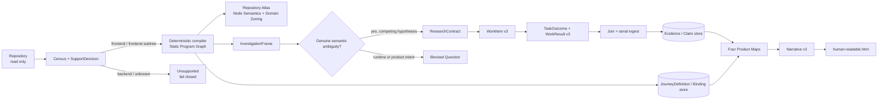

# Agentic Workspace Intelligence Skills

这个仓库包含两类能力：

- `repo-*`：把一个前端仓库或全栈仓库中的前端子树，编译成可验证的程序图、渐进式 Repository Atlas、用户旅程、四张 Product Map 和人读页面。
- `agentic-*`：为多仓 workspace 收集、规范化和导出数据源。

`repo-understanding` 当前执行契约是 frontend-first v3。Host runtime 负责运行 agent；本项目只提供确定性 kernel、CLI、schema 和 runtime-neutral skills，不启动模型，也不绑定某个 agent runtime。

## Repo Understanding 的产品边界

支持范围由 `static/support-decision.json` 明确记录：

| 仓库类型 | 结果 | 行为 |
|---|---|---|
| frontend | `supported-frontend` | 分析整个前端范围 |
| fullstack | `frontend-subtree-only` | 只分析确定识别出的前端 roots |
| backend | `unsupported` | fail closed，不派 ResearchContract |
| unknown | `unsupported` | fail closed，不把未知仓库猜成前端 |

多仓系统理解仍由 `agentic-datasource-orchestrator` 负责；单仓 repo-understanding 不跨仓扩围。

## 系统形状



关键约束：

- TypeScript、Babel 和 Vue compiler 负责确定性结构抽取；解析或 import 失败进入 diagnostics，不转成 agent 任务。
- Repository Atlas 在同一棵文件树上渐进增加节点语义和 Agent 领域划分；领域结果必须独立审核，kernel 不使用静态规则替 Agent 分类。
- 只有至少存在两个竞争 Hypothesis 的真实语义歧义，才能生成 `ResearchContract`。
- `runtime-external-blocked` 留作运行时限制；`product-intent` 交给用户或产品资料，均不派 repo explorer。
- Worker 只能写自己的 TaskOutcome 和 WorkResult；只有 orchestrator ingest 能更新 authoritative store。
- Host 可以并行执行独立 WorkItem，但必须等待 Join 后串行 ingest。
- Journey 未闭合、关键问题未解决、Map 过期或 narrative 未 grounding 时，交付门禁不会通过。

## 六类权威数据

| 数据 | 作用 | 主要路径 |
|---|---|---|
| Static Program Graph | 编译得到的文件、模块、route、page、UI event、handler、state、request、endpoint 等结构 | `static/static-program-graph.json` |
| Node Semantic Catalog | 每个可分析代码文件的职责、输入、动作、状态、输出、边界、协作者与未知项 | `store/node-semantics.json` |
| Repository Zones | 经独立审核的仓库领域、子领域、文件唯一归属与待确认项 | `planning/repository-zones.json` |
| Semantic store | 源文件 Evidence 和经 TaskOutcome 治理后的 accepted/refuted Claim | `store/evidence.jsonl`、`store/claims.jsonl` |
| Journey store | actor、goal、trigger、steps、feedback、outcomes 及代码实体绑定和 closure report | `store/journeys/` |
| Product Maps | 面向消费的 Application、Experience、Runtime Flow、Change 四张确定性投影 | `projections/` |

Product Map 的 `projectionKey` 绑定 snapshot、Static Program Graph、accepted Claim 集、Journey 集和 InvestigationFrame。任一语义输入变化都会使旧 Map 失效；`createdAt`、`updatedAt`、`generatedAt`、`evaluatedAt`、`writtenAt` 等运行时间字段不参与 key，保证同一 snapshot 跨运行重建稳定。

## 五分钟看懂命令

```bash
# 安装 workspace 依赖
npm install

# 契约测试
npm run eval:contract

# 只做 census / support / static graph / frame 检查
npm run understanding:harness -- scout \
  --repo /path/to/frontend-repo \
  --out /tmp/frontend-understanding

# 建立一次 v3 分析包
npm run understanding:harness -- analyze \
  --repo /path/to/frontend-repo \
  --out /tmp/frontend-understanding \
  --mode fast

# nextAction 是编排唯一依据
npm run understanding:harness -- status \
  --package /tmp/frontend-understanding
```

之后按 `status.nextAction` 执行：

| `nextAction` | 动作 |
|---|---|
| `dispatch` | 运行 `dispatch`，让 host 执行 manifest 中的 WorkItem |
| `await-results` | 等待 worker 写完 TaskOutcome 与 WorkResult |
| `ingest` | 逐个运行 `ingest --work-result ...` |
| `project` | 生成或刷新四张 Product Map；有 narrative 时同时可生成 HTML |
| `synthesize` | 生成只读四张 Map 和 Journey 的 narrative WorkItem |
| `blocked` | 查看 verification、OpenQuestion 和 Journey closure；产品输入确认后用 `journeys` 受控导入，不得手改 store |
| `done` | 当前 snapshot 的全部门禁已闭合 |
| `unsupported` | 当前仓库不在 frontend-first 支持范围内 |

常用命令：

```bash
npm run understanding:harness -- dispatch --package /tmp/frontend-understanding
npm run understanding:harness -- ingest --package /tmp/frontend-understanding \
  --work-result /tmp/frontend-understanding/work/results/<item>.result.json
npm run understanding:harness -- journeys --package /tmp/frontend-understanding \
  --definitions /path/to/definitions.json --bindings /path/to/bindings.json
npm run understanding:harness -- project --package /tmp/frontend-understanding --only maps
npm run understanding:harness -- synthesize --package /tmp/frontend-understanding
npm run understanding:harness -- html --package /tmp/frontend-understanding
npm run understanding:harness -- verify --package /tmp/frontend-understanding
npm run understanding:harness -- report --package /tmp/frontend-understanding
npm run understanding:harness -- debug --package /tmp/frontend-understanding
npm run understanding:harness -- atlas --package /tmp/frontend-understanding
```

`--incremental --base <ref>` 会写 `static/invalidation.json`，记录 changed files 和受影响实体；当前实现仍确定性重建 Static Program Graph，不复用旧语义结论冒充增量正确性。

## 产物包

```text
<package>/
├── index.json
├── static/
│   ├── inventory.json
│   ├── code-map.json
│   ├── repo-profile.json
│   ├── support-decision.json
│   ├── static-program-graph.json
│   ├── community-map.json
│   ├── neighbor-map.json
│   ├── investigation-frame.json
│   └── invalidation.json             # 仅 incremental 运行
├── planning/
│   ├── manifest.json
│   ├── node-semantic-batches.json
│   ├── repository-zone-agent-plan.json
│   ├── repository-zones.json
│   ├── open-questions.json
│   └── contracts/*.json
├── research/
│   ├── node-semantics/{contexts,results,review-dispatch,reviews}/
│   ├── repository-zones/{context,result,review}.json
│   └── dispatch/<batch>/
│       ├── manifest.json
│       ├── *.md
│       └── *.task-outcome.json       # worker 写
├── work/
│   ├── items/*.json
│   └── results/*.result.json         # worker 写 envelope
├── store/
│   ├── evidence.jsonl
│   ├── claims.jsonl
│   ├── semantic-store-manifest.json
│   ├── node-semantics.json
│   ├── journeys/
│   │   ├── definitions/*.json
│   │   ├── bindings/*.json
│   │   ├── closure/*.json
│   │   └── manifest.json
│   └── run-events.jsonl
├── state/
│   ├── run-state.json
│   └── run-config.json
├── projections/
│   ├── application-map.json
│   ├── experience-map.json
│   ├── runtime-flow-map.json
│   ├── change-map.json
│   └── manifest.json
├── synthesis/
│   ├── research-contract.json
│   ├── request.md
│   └── narrative.json
├── verification/frontend-verification.json
├── debug/agent-trace.jsonl
├── report.md
├── repository-atlas.html
└── human-readable.html
```

`repository-atlas.html` 是静态图、节点语义和领域划分的渐进式视图；`human-readable.html` 是最终消费层。两者都不是事实源，不能自行发现或改写事实。

## Skill 家族

### 单仓前端理解

| Skill | 角色 | 输入 / 输出边界 |
|---|---|---|
| [`repo-understanding`](skills/repo-understanding/SKILL.md) | orchestrator | 只按 `status.nextAction` 调 CLI |
| [`repo-explorer`](skills/repo-explorer/SKILL.md) | semantic research | ResearchContract → TaskOutcome |
| [`repo-fact-verifier`](skills/repo-fact-verifier/SKILL.md) | adversarial adjudication | 只裁决 contracted Hypothesis 或高风险 Journey binding |
| [`repo-synthesizer`](skills/repo-synthesizer/SKILL.md) | narrative | 只读四张 Map 和 governed refs |
| [`repo-human-readable`](skills/repo-human-readable/SKILL.md) | deterministic presentation | 不生产事实 |

### 多仓 workspace 数据源

| Skill | 角色 |
|---|---|
| [`agentic-datasource-orchestrator`](skills/agentic-datasource-orchestrator/SKILL.md) | 协调 producer skill 分阶段填充数据池并合并导出 |
| [`agentic-coding-audit`](skills/agentic-coding-audit/SKILL.md) | 收集确定性静态证据和带 evidenceRefs 的分析 |
| [`agentic-ce-bridge`](skills/agentic-ce-bridge/SKILL.md) | 桥接外部 agent runtime 结论；parse 失败保留 raw，不伪造分析 |

## 验证与调试

```bash
npm run eval:contract
npm run eval:all
node --test packages/repo-understanding-kernel/test/*.test.mjs
```

`verify` 分阶段检查 SupportDecision、snapshot identity、Static Program Graph、semantic store hash、在途 WorkItem、blocking failure、ResearchContract、关键问题、Journey closure、Product Map freshness、narrative grounding 和 HTML freshness。exit code 非零表示当前包不能交付。

`trace` 只记录真实 telemetry；没有数据时写 `usage.status=unavailable`，禁止估算 token、cost 或 duration。

## v3 已移除的旧路径

旧版的 gap/coverage 驱动循环、单一 FactGraph、通用 explorer fan-out、raw analysis ingest、generic backend fallback 以及 architecture/domain/flow 的旧投影链，均不再属于 repo-understanding 的执行契约。`analyze` 会清理旧包中的相关兼容产物，避免 v2/v3 混包。

## 仓库结构

```text
.
├── skills/      runtime-neutral skill instructions
├── packages/    repo-understanding kernel、CLI、schemas、tests
├── shared/      多仓 datasource 共用逻辑
├── evals/       contract、behavioral、triggering、knowledge、retrieval、trajectory、cost
├── docs/        当前设计、教程和维护计划
└── outputs/     本地生成物，不是源码
```

## 文档地图

| 想了解 | 文档 |
|---|---|
| v3 权威设计 | [Repo Understanding Harness Design](docs/repo-understanding-harness-design.md) |
| 从空目录跑到 HTML | [Repo Understanding Tutorial](docs/repo-understanding-harness-tutorial.md) |
| skill 与实现维护边界 | [Harness Skill Plan](docs/harness-skill-plan.md) |
| Stage 6 文件节点语义 | [Node Semantic Enrichment](docs/stage-6-node-semantic-enrichment-design.md) |
| Stage 7 Agent 领域划分 | [Agent Domain Zoning](docs/stage-7-agent-domain-zoning-design.md) |
| 历史 v1/v2：Skill 规范化 | [设计](docs/skill-standardization-design.md) · [构建指南](docs/skill-standardization-build-guide.md) · [返修](docs/skill-standardization-remediation.md) |
| 历史 v2：模型分档 | [设计](docs/model-tier-dispatch-design.md) · [构建指南](docs/model-tier-dispatch-build-guide.md) |
| 契约测试 | [evals/README](evals/README.md) |

## 开发守则

- Worker 不直接改 store、Journey、Map、state 或 trace。
- 新增语义工作必须先有 ResearchContract；解析器、import、protected-file 问题留在 diagnostics。
- 新增 Product Map 字段必须绑定 projectionKey，并补 schema、deterministic rebuild 和 stale-input test。
- 新增 Journey 必须同时有 JourneyDefinition、JourneyBinding 和 closure report。
- 受保护文件只允许 metadata evidence。
- 人读层使用中文；标识符、路径和专有名词保持原样。
